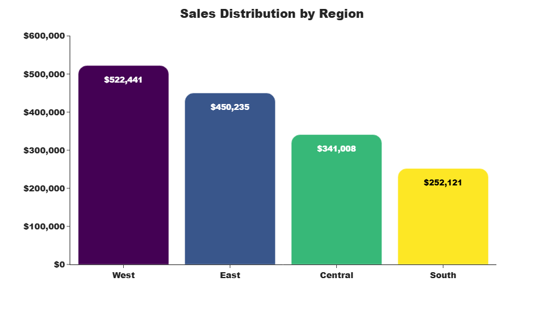

# 📊 Sales & Profitability Analysis

## 📌 Project Overview
This project analyzes sales performance, profitability, customer behavior, and product-level insights using Python. The goal is to identify key business drivers and provide actionable recommendations for improving performance.

---

## 🎯 Objectives
- Analyze sales trends over time  
- Identify high-performing regions and segments  
- Detect loss-making products and categories  
- Evaluate return behavior  
- Validate insights using statistical tests (T-test & ANOVA)

---

## 🛠 Tools & Technologies
- Python (Pandas, NumPy)
- Data Visualization (Plotly, Seaborn, Matplotlib)
- Statistical Analysis (SciPy)
- Jupyter Notebook

---

## 📂 Project Structure
- `data/` → Dataset used for analysis  
- `notebooks/` → Jupyter Notebook with full analysis  
- `reports/` → Final HTML report  
- `images/` → Visualizations used in the project  

---

## 📊 Key Insights
- Sales show consistent growth but profitability is inconsistent  
- Technology is the most profitable category  
- Furniture has very low profit margins  
- Certain sub-categories (e.g., Binders, Tables) generate significant losses  
- Profit is influenced more by pricing and cost than by sales volume  
- Returns and regions do not significantly impact profitability (statistical validation)

---

## 💼 Business Recommendations
- Focus on high-margin categories like Technology  
- Reduce losses in underperforming sub-categories  
- Optimize pricing and discount strategies  
- Improve cost efficiency instead of relying only on sales growth  

---

## 📈 View Full Report
👉 **Explore the complete analysis with visuals, insights, and code::**

(https://htmlpreview.github.io/?https://github.com/irfankafait/sales-analysis-project/blob/main/reports/sales_analysis_project.html)

---

## 📸 Sample Visualizations

  
  

---

## 👤 Author
**Arfan Chaudhry**  
Data Analyst | Excel | Python | Visualization  

---

## ⭐ If you found this project useful, feel free to star the repository!
